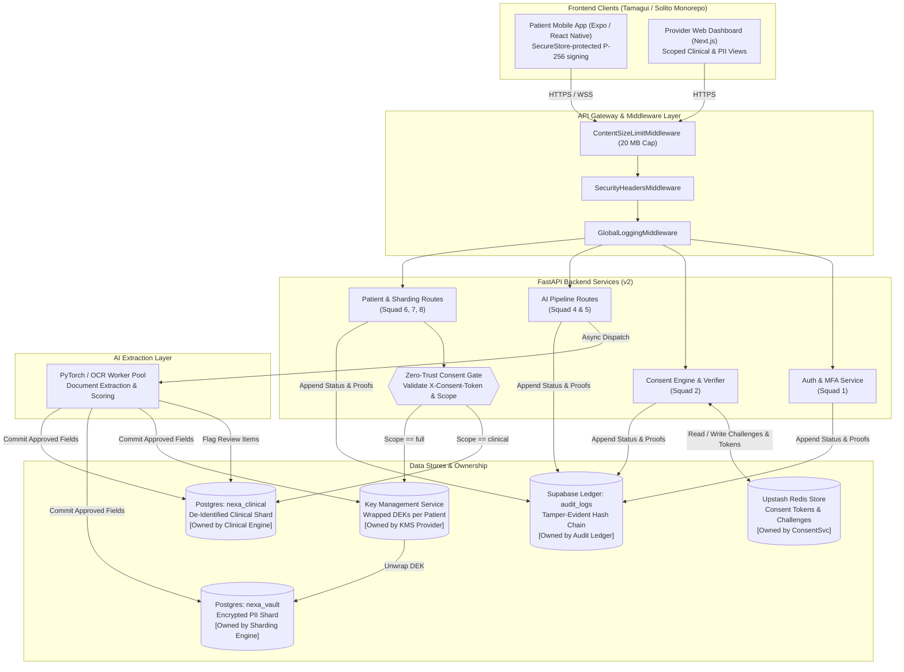
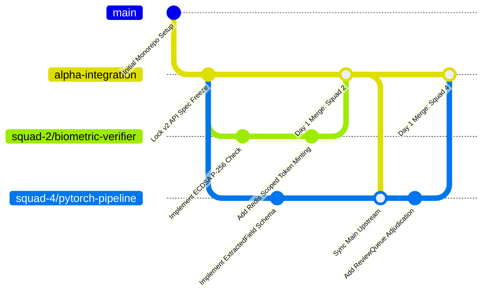

# Nexa Care Alpha Demo — System Architecture & Integration Strategy

**Version:** `v2.0.0-alpha`  
**Status:** LOCKED (Specification Freeze for 10-Squad Alpha Milestone)

---

## 1. High-Level Component & Architecture Diagram

The system follows a privacy-first, zero-trust retrieval architecture. Vertical sharding ensures that Personally Identifiable Information (PII) and de-identified clinical data never co-locate in plaintext. Every data read passes through a strict **Consent Gate**.

---

### Key Management Service (KMS) Status & Environment Scope
To prevent overclaiming architecture maturity, the Key Management Service implementation is explicitly bounded by environment:
- **Alpha Demo (`v2.0.0-alpha`):** `LocalEnvelopeProvider / dev KEK only`. Envelope encryption is wired locally via HKDF KEK derivation (`KEK_ROOT_SECRET`) and active DEK unwrapping in `patient_dek_store`. Cloud provider integrations are deferred for the alpha milestone.
- **Production Pilot:** Cloud KMS (AWS KMS / Azure Key Vault / GCP KMS hardware security modules) is strictly required before any live patient pilot deployment.

---

## 2. Data Store Ownership Matrix

To prevent data corruption and cross-workstream coupling, each physical data store is strictly assigned to a single owning service. Direct database access across domain boundaries is prohibited.

| Physical Data Store | Store Type | Owning Service / Workstream | Allowed Writing Squads | Allowed Reading Squads |
| :--- | :--- | :--- | :--- | :--- |
| `nexa_vault` | Postgres Table | Sharding & KMS Engine (Squad 6) | Squad 6 (Ingestion Commit) | Squad 6 (Gated PII View) |
| `nexa_clinical` | Postgres Table | Clinical Engine (Squad 7/8) | Squad 6, Squad 8 (Timeline) | Squad 7 (Clinical Dashboard) |
| `patient_dek_store` | Postgres Table | Crypto KMS Provider (Squad 6) | Squad 6 (Key Generation) | Squad 6 (Key Unwrapping) |
| `patient_push_tokens`| Postgres Table | Push Notification Service (Squad 2) | Squad 2 (Device Registration)| Squad 2 (Push Dispatch) |
| `Upstash Redis Store`| Redis Keyspace | Consent & Rate Limiter (Squad 1/2) | Squad 1 (MFA), Squad 2 (Consent)| Squad 1, Squad 2, All Gated Routes |
| `audit_logs` | Supabase Table | Observability Ledger (Squad 9) | Squad 9 Ledger Service Only | Squad 9 (Audit Reports) |

---

## 3. Zero-Trust Consent Gate Specification

Every read request directed at patient health records (`GET /api/v2/patient/*`) must traverse the **Zero-Trust Consent Gate**:

1. **Header Extraction:** The gateway intercepts `X-Consent-Token` and `X-Consent-Purpose`.
2. **Redis Resolution:** The engine queries Redis (`resolve_consent_token()`) to verify the token exists and is active.
3. **Scope Verification:**
   - If the token payload specifies `scope: "clinical"`, the request is permitted to read only `nexa_clinical`. Accessing `nexa_vault` raises `403 Forbidden`.
   - If the token payload specifies `scope: "full"`, the request is permitted to query `KMS` to unwrap the patient's Data Encryption Key (DEK) and decrypt attributes in `nexa_vault`.
4. **Audit Enforcement:** Every attempt (successful or denied) logs an immutable entry to `audit_logs`. If the audit ledger fails to record (`503 Service Unavailable`), the read is aborted immediately (Fail-Closed).

> **Important Boundary Note (AI Pipeline Uploads vs. Operator Access):**  
> While patient clinical data reads strictly require doctor-style consent tokens, document ingestion uploads (`POST /api/v2/pipeline/documents/upload`) follow an evolutionary authorization path:  
> - **Alpha Behavior:** Pipeline upload requires a scoped patient consent token (`require_consent`), simulating a doctor uploading a report during an active encounter.  
> - **Future Pilot Behavior:** Pipeline upload will transition to organization/data-operator authorization (`require_role("data_operator")`) plus patient linkage policy and mandatory audit logging, preventing consent token requirements from blocking bulk administrative archival ingestion.

---

## 4. Alpha Milestone Integration & Branching Setup

With 10 squads working concurrently in a monorepo (`nexa-client/` + `app/`), integration chaos is the primary project risk. All teams must follow the locked Git workflow below.

### 4.1 Branching Strategy
- **Target Integration Branch:** `alpha-integration` (Protected Branch).
- **Production Branch:** `main` (Only updated via signed release PRs from `alpha-integration`).
- **Feature Branch Naming Convention:** `squad-{N}/{feature-name}` (e.g., `squad-2/biometric-verifier`, `squad-4/pytorch-pipeline`).
- **Daily Merge Cadence:** Every squad lead must open and merge a pull request to `alpha-integration` by **16:00 UTC daily**. Long-lived feature branches (>48 hours) are prohibited.

### 4.2 CI/CD Gate Rules (Mandatory Pre-Merge Requirements)

Before any pull request can be merged into `alpha-integration`, the GitHub Actions automated pipeline must pass 100% of the following checks:

1. **Python Linter & Formatter (`ruff check .`):** Zero syntax errors, zero lint violations, and adherence to Python 3.12+ style guidelines.
2. **Backend Automated Test Suite (`pytest tests/ -v`):** All integration and unit tests must pass with zero unhandled exceptions or coroutine warnings.
3. **Contract Compliance Check:** Any modification to `app/api/v2/*` routes must strictly match the JSON schemas and status codes defined in `docs/API-CONTRACTS.md`.
4. **Frontend Type Check (`cd nexa-client && yarn tsc --noEmit`):** Zero TypeScript compilation errors across the monorepo web and native workspaces.
5. **No Migration Drift (`alembic check`):** Database models in `app/models/` must match existing Alembic migration scripts.
