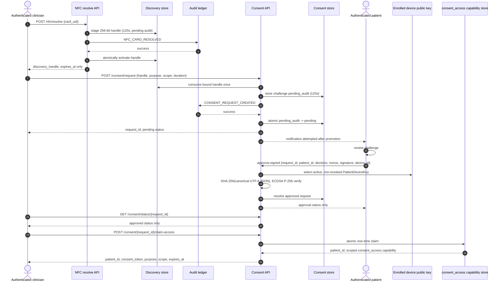

# Nexa Care — Canonical Discovery, Consent, and Claim Sequence

The canonical JSON signing fields are `access_duration`, `challenge_nonce`,
`decision`, `device_id`, `expires_at`, `issued_at`, `patient_id`,
`protocol_version` (`nexa-consent-v2`), `provider_id`, `purpose`,
`request_id`, and `scope`; serialization uses `sort_keys=true`,
`separators=(",", ":")`, and `ensure_ascii=false`.

Discovery and consent challenges are inert before their audit transitions.
Failed cleanup can leave bytes but never authority. The direct routine issuer
routes are retired; a claim replay cannot be replaced by a direct routine
capability.

## Separate emergency sequence

Break-glass does not consume discovery. Recent provider MFA, a controlled reason
code, and justification are required before the server selects a
minimum-necessary emergency scope with a 15-minute TTL, audits it, and attempts
patient notification.
