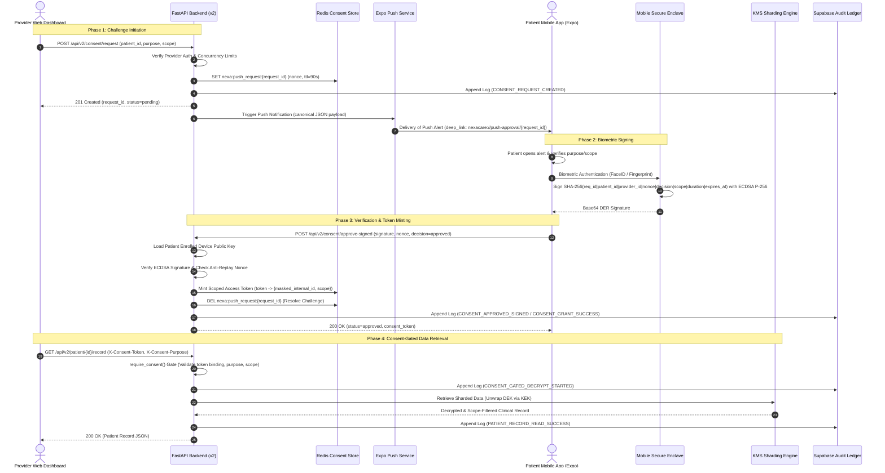
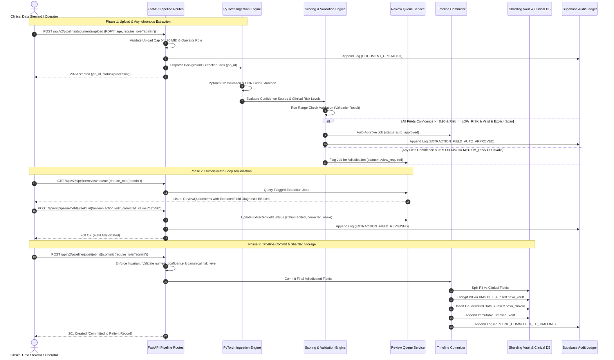

# Nexa Care Alpha Demo — Canonical Sequence Diagrams

**Version:** `v2.0.0-alpha`  
**Status:** LOCKED & ENFORCED (Specification Freeze & Implementation Wiring)

---

## Architectural Notes & Deviations from Day 1 Plan

During Days 3–11 integration and security hardening, the actual implementation incorporated four critical deviations and refinements beyond the initial Day 1 architectural sketch:

1. **Precision Access Gate Routing:**
   - *Day 1 Plan:* Envisioned a single `require_consent` dependency applied blindly to all protected routes.
   - *Real Implementation:* Divided access control into three specialized gates: `require_consent(purpose)` for clinicians accessing clinical records; `require_self_patient_access()` for patients accessing their own dashboard logs (preventing IDOR without synthetic token generation); and `require_role(role)` for data stewards and operators managing AI ingestion jobs and review queues.
2. **Audit Event Separation (`PATIENT_RECORD_READ_SUCCESS`):**
   - *Day 1 Plan:* Recorded only `CONSENT_GATED_DECRYPT_STARTED` during middleware access gating.
   - *Real Implementation:* Emits `CONSENT_GATED_DECRYPT_STARTED` upon entering the gate and an explicit **`PATIENT_RECORD_READ_SUCCESS`** event after the decrypted clinical data is verified and returned to the provider.
3. **Canonical Pipe-Delimited Signing Contract:**
   - *Day 1 Plan:* Proposed a minimal colon-delimited string (`nonce:request_id:patient_id:decision`).
   - *Real Implementation:* Enforces an 8-attribute pipe-delimited payload hash (`SHA256(request_id|patient_id|provider_id|challenge_nonce|decision|requested_scope|access_duration_seconds|expires_at)`) signed via ECDSA P-256 inside the mobile Secure Enclave.
4. **Strict Medical Adjudication Thresholds (`0.95 + LOW_RISK`):**
   - *Day 1 Plan:* Allowed auto-approval at `confidence >= 0.85`.
   - *Real Implementation:* Enforces that only observations meeting all 6 criteria (`LOW_RISK`, `confidence >= 0.95`, `is_valid == true`, no clinical conflict, valid `source_page`, and valid `source_bbox`) receive `status: "auto_approved"`. Any observation flagged as `MEDIUM_RISK`, `HIGH_RISK`, or `CRITICAL_RISK` routes strictly to the human review queue.
5. **Pipeline Upload Authorization Boundary (Alpha vs. Future Pilot):**
   - *Alpha Behavior:* Pipeline upload (`POST /api/v2/pipeline/documents/upload`) requires a scoped patient consent token (`X-Consent-Token`), simulating a doctor upload during an encounter.
   - *Future Pilot Behavior:* Pipeline upload will use role-based organization authorization (`require_role("data_operator")`) plus patient linkage policy and audit logging, decoupling administrative archival ingestion from interactive doctor consent tokens.

---

## 1. Real-Phone Cryptographic Consent Flow

---

## 2. AI Data Ingestion & Human-in-the-Loop Pipeline Flow

