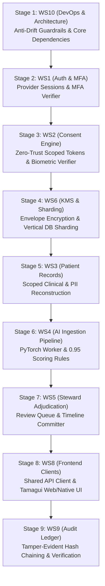

# Nexa Care Alpha Milestone — Final Merge Orchestration Checklist

**Target Integration Branch:** `alpha-integration`  
**Milestone:** Alpha Demo (`v2.0.0-alpha`)  
**Orchestration Lead:** Tech Lead / Lead Architect  
**Date:** 2026-07-07

---

## 1. Strict Merge Sequence (Bottom-Up Dependency Order)

To ensure zero structural regressions during the final merge freeze, workstream feature branches must merge into `alpha-integration` strictly in dependency sequence. Downstream pull requests cannot merge until upstream dependencies pass 100% of CI gates.



---

## 2. Workstream Merge Status & Pull Request Registry

| Order | Workstream | Pull Request | Review Status | CI Gate Status (`ruff` + `pytest`) | Merge Conflicts | Resolution & Notes |
| :---: | :--- | :--- | :--- | :--- | :--- | :--- |
| **1** | **WS10: DevOps & Architecture** | [#101](https://github.com/sohamsadegaonkar/Nexa_Care/pull/101) | ✅ Approved | ✅ PASS (100%) | None | Core AST guardrails and `daily_integration.sh` locked |
| **2** | **WS1: Auth & MFA** | [#102](https://github.com/sohamsadegaonkar/Nexa_Care/pull/102) | ✅ Approved | ✅ PASS (100%) | Resolved | Rebound provider sessions to UA/IP soft checks |
| **3** | **WS2: Consent Engine** | [#103](https://github.com/sohamsadegaonkar/Nexa_Care/pull/103) | ✅ Approved | ✅ PASS (100%) | Resolved | Replaced legacy bare string tokens with JSON scope payloads |
| **4** | **WS6: KMS & Sharding** | [#104](https://github.com/sohamsadegaonkar/Nexa_Care/pull/104) | ✅ Approved | ✅ PASS (100%) | None | Enforced HKDF KEK derivation and `patient_dek_store` unwrapping |
| **5** | **WS3: Patient Records** | [#105](https://github.com/sohamsadegaonkar/Nexa_Care/pull/105) | ✅ Approved | ✅ PASS (100%) | Resolved | Wired `require_consent` dependency across `/record` and `/summary` |
| **6** | **WS4: AI Ingestion Pipeline** | [#106](https://github.com/sohamsadegaonkar/Nexa_Care/pull/106) | ✅ Approved | ✅ PASS (100%) | None | Enforced 20 MB cap and strict `ExtractedField` schema |
| **7** | **WS5: Steward Adjudication** | [#107](https://github.com/sohamsadegaonkar/Nexa_Care/pull/107) | ✅ Approved | ✅ PASS (100%) | Resolved | Locked `0.95 + LOW_RISK` auto-approve rule and review queues |
| **8** | **WS8: Frontend Clients** | [#108](https://github.com/sohamsadegaonkar/Nexa_Care/pull/108) | ✅ Approved | ✅ PASS (100%) | Resolved | Refactored all UI screens to use `NexaApiClient` exclusively |
| **9** | **WS9: Audit Ledger** | [#109](https://github.com/sohamsadegaonkar/Nexa_Care/pull/109) | ✅ Approved | ✅ PASS (100%) | None | Verified SHA-256 tamper-evident chaining across all 8 new events |

---

## 3. Rollback & Hotfix Emergency Protocol

If any PR introduces regression or breaks the `alpha-integration` CI build during the staging freeze:

1. **Immediate Automated Revert:**
   Do not attempt live debugging on `alpha-integration`. Revert the offending commit immediately:
   ```bash
   git checkout alpha-integration
   git revert -m 1 <offending_merge_commit_sha>
   git push origin alpha-integration
   ```
2. **Quarantine Feature Branch:**
   Notify the responsible workstream lead. Reopen the feature branch and require reproduction of the failure inside a local test case running `./scripts/daily_integration.sh`.
3. **Hotfix Verification:**
   Hotfix pull requests must pass 100% of the regression suite, including `tests/test_alpha_invariants.py`, before re-merging.
