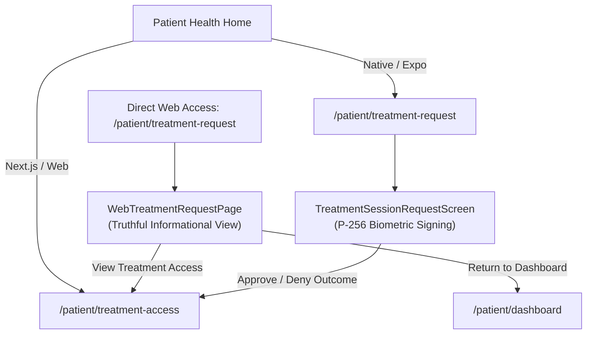

# Patient Treatment Session Visibility, Platform Safety, and Revocation Governance

[Repository agent contract](../../AGENTS.md) · [Security non-regression standard](SECURITY_NON_REGRESSION.md) · [India regulatory baseline](INDIA_REGULATORY_BASELINE.md) · [Engineering constitution](NEXA_CARE_ENGINEERING_CONSTITUTION.md)

Status: Enforced patient-product governance  
Owner: Nexa Care engineering leadership  
Reviewers: Security reviewer, clinical reviewer, patient-product owner  
Last reviewed: 2026-09-19  
Repository baseline: `3ec88efb06a97a1f8de021dd115feeb776d6efdd` on `main`; Alembic head `20260918_treatment_vitals_encounter`

---

## 1. Scope & Objective

This document governs the patient-facing Treatment Session visibility, platform-specific approval behavior, and revocation authority boundaries delivered in Slice 10B / Task-2.

It guarantees:
1. **Platform Safety & No Fake Web Signing:** Treatment approvals strictly require non-exportable hardware-backed P-256 private keys on enrolled native mobile devices. Web platforms must never simulate browser cryptographic signing or request private key export.
2. **Elimination of Web 404:** Web routes provide truthful, platform-aware informational guidance (`/patient/treatment-request`) explaining the mobile device requirement, with seamless navigation to Treatment Access (`/patient/treatment-access`) and the patient dashboard.
3. **Truthful Treatment Access Visibility:** A dedicated patient surface displays active, expired, and revoked treatment access grants without exposing internal database UUIDs, bearer token hashes, or provider session hashes.
4. **Cryptographic Self-Revocation Authority:** Safe patient-self revocation via a server-owned HMAC-signed grant reference (`public_ref`), with multi-layer invalidation that immediately cuts off clinician write authority at the server gate.
5. **Architectural Separation:** Treatment Access (patient-granted active/historical session authority) and Access History (audit ledger of who read patient records) remain strictly separate concepts and surfaces.

---

## 2. Platform-Specific Treatment Approval Architecture

### Native Mobile Approval Flow (`TreatmentSessionRequestScreen.tsx`)
- Operates exclusively on enrolled native devices (iOS / Android) hosting non-exportable P-256 keys in hardware keystores (Secure Enclave / Android Keystore).
- Enforces strict challenge integrity: binds `request_id`, `patient_id`, `provider_id`, `hospital_id`, `provider_session_binding_hash`, `challenge_nonce`, `allowed_operations`, `access_duration`, and `treatment_context_hash`.
- Upon approval or denial, replaces destination navigation to `/patient/treatment-access` where the patient can verify their active/historical grant status.

### Web Experience (`WebTreatmentRequestPage.tsx`)
- Web browsers cannot access non-exportable mobile hardware keys.
- Web routes must never attempt browser-based signing, mock biometrics, or prompt users to copy private keys.
- `/patient/treatment-request` on Next.js renders an accessible, senior-friendly informational card:
  - Explains the hardware-backed mobile device requirement.
  - Explains how to approve on an enrolled smartphone.
  - Provides direct navigation to "View Treatment Access" (`/patient/treatment-access`) and "Return to Dashboard".

---

## 3. Identifier Graph & Public Grant Reference (`public_ref`)

### Problem & Phase 1 Audit
The durable model for consent grants is `ConsentGrantLog`. Its primary key is an auto-generated PostgreSQL UUID (`id`).
When a provider claims an approved Treatment Session, a `ConsentGrantLog` row is created with `request_id = treatment_session_request_id` and `scope = ["treatment"]`.
Previously:
- `GET /api/v2/consent/history/self` returned `ConsentHistoryItem.id = str(row.id)` (the internal database UUID PK).
- `DELETE /api/v2/consent/request/{request_id}/revoke` expected the treatment request UUID (`request_id`).
- Passing `ConsentHistoryItem.id` to the revoke endpoint failed with a 404, and the revoke endpoint only purged standard `consent_access` keys.

### Server-Owned `public_ref` Solution (Zero DB Migrations)
To solve this without schema migrations or exposing internal database UUIDs, the server derives a cryptographic, domain-separated grant reference:

$$\text{public\_ref} = \text{"gref\_"} \mathbin{\Vert} \text{grant\_id.hex} \mathbin{\Vert} \text{"\_"} \mathbin{\Vert} \text{HMAC}_{\text{server\_secret}}(\text{"patient\_grant\_ref\_v1:"} \mathbin{\Vert} \text{patient\_id} \mathbin{\Vert} \text{":"} \mathbin{\Vert} \text{grant\_id})[0..32]$$

### Invariants:
1. **Zero Database Migrations:** Derived deterministically at serialization time without adding database columns.
2. **Strict Cross-Patient Isolation:** When `DELETE /api/v2/consent/history/self/{public_ref}` is called, the server derives `patient_id` solely from the authenticated patient session (`get_scoped_session`). If Patient B attempts to present Patient A's `public_ref`, the HMAC validation fails closed with a `404 Not Found`.
3. **Zero Internal UUID Exposure:** `ConsentHistoryItem.id` and `ConsentHistoryItem.public_ref` both carry `public_ref`. The internal database UUID is never projected to the client.

---

## 4. Multi-Layer Revocation Semantics

When a patient invokes `DELETE /api/v2/consent/history/self/{public_ref}`:

1. **Durable Consent Grant Invalidation:**
   - PostgreSQL row lock: `select(ConsentGrantLog).with_for_update()`.
   - Sets `revoked_at = now` and `revoked_reason = "patient_revoked"`.
2. **Durable Clinical Access Session Invalidation:**
   - Calls `revoke_clinical_access_session_by_request(db, consent_request_id=grant.request_id, reason="PATIENT_REVOKED", revoked_at=now)`.
   - Sets `ClinicalAccessSessionRecord.status = "REVOKED"` and `revoked_at = now`.
3. **Live Redis Capability Invalidation:**
   - Calls `invalidate_treatment_session_v1_request(grant.request_id)`, deleting `treatment_session_v1:claim:{request_id}` and `treatment_session_v1:capability:{digest}`.
   - If unclaimed `treatment_session_request:{request_id}` exists, updates status to `"revoked"`.
   - Calls `invalidate_request(grant.request_id)` to purge any standard consent access keys.
4. **Clinical Write Gate Cut-off:**
   - Subsequent calls to `POST /api/v2/treatment-session/v1/vitals` (`WRITE_VITALS`) and `POST /api/v2/treatment-session/v1/encounter` (`CREATE_ENCOUNTER`) pass through `require_clinical_session`.
   - `validate_treatment_session_v1` checks `_durable_grant_matches` (`grant.revoked_at is None`) and `_durable_session_matches` (`session.status == "ACTIVE" and session.revoked_at is None`).
   - Both fail closed with `403 Forbidden` (`TREATMENT_SESSION_NOT_AUTHORIZED`).
5. **Immutable Audit Trail:**
   - Enqueues `PATIENT_CONSENT_REVOKED` audit event with `actor_uid = patient_id` and `target_id = public_ref`.

---

## 5. Treatment Access vs Access History Separation

| Dimension | Access History (`/patient/access-history`) | Treatment Access (`/patient/treatment-access`) |
|---|---|---|
| **Concept** | Who accessed / read patient records | What ongoing / past treatment authority the patient granted |
| **Backend Route** | `GET /api/v2/patient/me/access-history` | `GET /api/v2/consent/history/self` |
| **Data Source** | Audit ledger projection (read events) | `ConsentGrantLog` (treatment / consent grants) |
| **Actions** | Filter by Routine / Emergency Break-Glass | Revoke active treatment access |
| **Identity Visibility** | Doctor display name & hospital name | Stated purpose, validity window, status |
